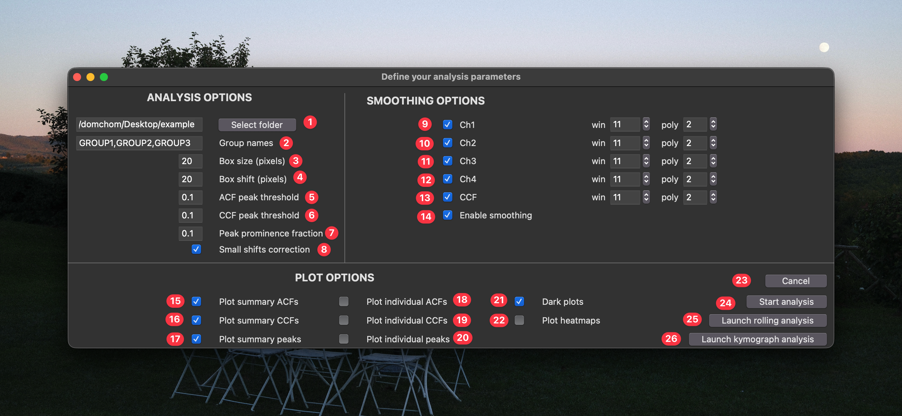
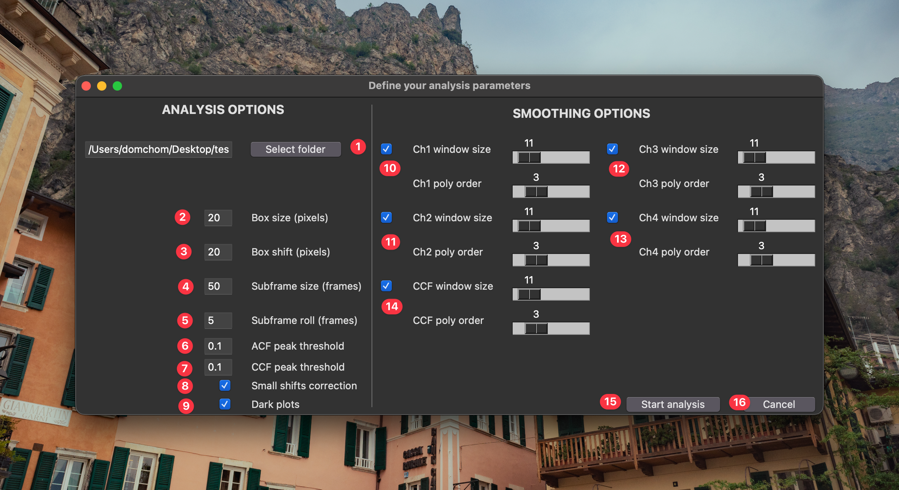
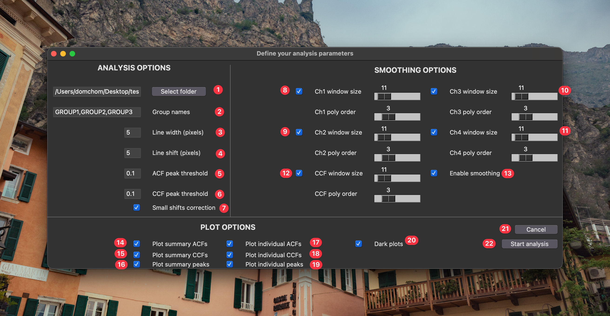

[](https://github.com/zacswider/waveAnalysis/actions/workflows/CI.yml)


# Wave analysis scripts
This workflow was written to batch analyze excitable / oscillatory dynamics in multichannel time lapse datasets. It was inspired by a MATLAB framework written by Marcin Leda and Andrew Goryachev (published in Bement _et al.,_ 2015; PMID 26479320) and was reimagined here to increase speed, accuracy, and access. This pipeline analyzes signal period, amplitude, temporal duration, and (if applicable) the temporal shift between signals in short time lapse datasets (tens of frames, typically). We have also extended the ability to analyze these metrics between arbitrary numbers of channels and across extended time-lapse datasets (hundreds - thousands of frames).

## Overview

### Standard analysis

In this workflow, each channel is broken up in n boxes (the box size will depend on the size of the features of interest):


And each box is measured independently as follows:

The mean pixel intensity in each box, when viewed over time, is a readout for the oscillatory dynamics in that region. For each channel, the period of the oscillatory signal can be estimated by calculating the autocorrelation of that signal.


For multi-channel datasets, the temporal shift between the two signals is estimated by computing the cross-correlation of the channels (the CCF Shift). Additionally, it quantifies the shift as a percentage of the period (CCF % Phase Shift), offering a valuable means of normalizing data, particularly when dealing with varying periods.


Oscillation properties (e.g., signal peak, signal trough, signal amplitude, temporal duration) can be determined from each waveform. As a precaution for noisy data, which real-world data are more often than not, the signal are smoothed using a Savitzky–Golay filter to avoid quantifying spurious peaks.


Once each box has been independently quantified, they can be combined to estimate properties of the wave population. For example, in the example above we measured a period of 12 frames, is that measurement representative of the whole sample? By looking at the distribution of all period measurements, we can see that it is. 


Similarly, we can assess the population of signal shift measurements, and oscillation/wave properties.


If different groups are specified within the GUI, the script will generate a folder full of plots comparing signal properties between groups. Each comparison can optionally be annotated with a significance test — either non-parametric (Mann–Whitney for two groups, Kruskal–Wallis for more) or parametric (t-test / one-way ANOVA) — selectable in the GUI. Alongside the comparisons, quality plots report detection rates and per-image coverage so you can see how many bins each group's metrics rest on.


### Rolling analysis
The above workflow describes the analysis of datasets over the totality of their time axis. This is perfectly suitable for data containing only a few wave (or oscillation) periods. However, if your data instead contains tens, hundreds, or thousands of wave periods this analysis will be insufficient. Instead, we can calculate the dynamics within short and overlapping sub-sections of the dataset to track the changes in wave/oscillation properties over time.


### Kymograph analysis
The standard analysis method excels when capturing the wave dynamics of a cell from either a "top-down" or "en-face" perspective. However, a  drawback of en-face image capture is its reliance on multiple z-stacks to accommodate non-flat surfaces, resulting in longer time intervals between frames and potentially missing subtle temporal shifts among different signals. One strategy to alleviate this issue is to focus on a single medial slice of the edge of the cell, leading a single line of waves. Therefore, using a kymograph might be a preferred method to generate wave profiles compared to the binned box method above. 

So, we introduced a new method to conduct the same analysis as above with kymographs. Instead of dividing the image into boxes for temporal wave property measurements, we opt to segment entire columns of a kymograph. By assessing the fluorescence intensity along these columns, we can analyze the same parameters as with the standard method.


## Preparing data for analysis
Before running any analysis on your data, be sure to complete all necessary pre-processing steps. Some thing to consider:
- Any significant two-dimensional drift in your data will alter the detected wave dynamics. If drift is detectable, register your data ahead of time.
- Black spaces (e.g. from drift correction, or true background) should be cropped out.
- Bleaching or z-drift will both affect amplitude and width measurements. The best approach is to not have bleaching/drift to begin with as bleach correction algorithms can introduce their own artifacts. However, if desired, correct your data for bleaching before analyzing.
- The ideal dataset for standard and kymograph analysis will include only a few wave periods which are consistent in character. The ideal dataset for rolling analysis will include many wave periods (tens-thousands) which vary in character over time. 
- This tool draws on imageJ metadata to determine which dimensions are time, channels, slices, etc. Be sure that your files are saved appropriately before analyzing. If your metadata does not have the pixel size or frame interval accurately stored, it will just default to 1 for each.
- If files with more than one z plane are analyzed, the tool will max project them along the z-axis before analyzing.
- Currently, this tool agnostically analyzes the entire image. If you wish to only analyze a specific region, crop it into a separate file. In the future, I plan to incorporate the ability to pass in a mask to specifically measure one or more sub-regions of the image (e.g., to separate out measurements from individual cells, or separate out background regions). 

## Definition of Metrics

Metric names below match the column names in the output summary CSV. Values reported per image are the mean across that image's bins. The GUI's **Info & Glossary** panel carries the same definitions.

**Oscillation period**
- Period: The dominant oscillation period, measured as the temporal distance between a signal's first autocorrelation peak and the center of the autocorrelation curve (the most prominent peak nearest to zero-lag in the normalized autocorrelation function).

**Peak shape (per channel)**
- Peak Amp: The peak amplitude — the difference between Peak Apex and Peak Baseline (i.e., peak prominence), averaged across all detected peaks.
- Peak Rel Amp: Peak Amp divided by Peak Baseline, i.e. the amplitude normalized to the local baseline.
- Peak Apex: The average intensity at each detected peak location (the peak maximum), averaged across all detected peaks.
- Peak Baseline: The lowest trough value associated with each detected peak (the peak minimum), averaged across all detected peaks.
- Peak Width: The full width at half maximum (FWHM) of each detected peak.
- Peak Apex Offset: The temporal distance between a peak's apex and the midpoint of its two flanking troughs. Zero indicates a symmetric peak; non-zero values indicate rising/falling asymmetry, and it is most informative for non-sinusoidal waveforms.
- Peak Area: The area under each detected peak relative to its local baseline. The local baseline is the minimum signal value between the peak's left and right bases; the baseline-subtracted signal is integrated (trapezoidal) over that interval.

**Edge timing (per channel, from the rise/fall landmarks)**
- Rise Duration / Fall Duration: Time from the rising landmark up to the apex / from the apex down to the falling landmark (landmarks are placed at the chosen edge height).
- Rise minus Fall Duration: Rise duration minus fall duration; the sign indicates asymmetry direction.
- Rising Slope / Falling Slope: Mean rate of intensity change on the rising / falling edge. Max Rising / Falling Slope is the steepest instantaneous slope, and Rising/Falling Slope Ratio compares the two (1 = symmetric).

**Inter-channel shifts (multi-channel data)**
- CCF Shift: The temporal shift between two channels, measured from the peak of their cross-correlation (the most prominent peak nearest zero-lag). The sign indicates which channel leads.
- CCF % Phase Shift: The CCF Shift normalized to the period and expressed as a percentage of one cycle — useful for comparing signals with different periods.
- Peak-Apex Shift: The inter-channel shift between the channels' peak-apex times (a landmark-based shift, not from the CCF).
- Rising-Edge Shift / Falling-Edge Shift: The inter-channel shift measured where each channel crosses the chosen edge height on the rising / falling edge.
- Rise-Apex Shift Diff / Fall-Apex Shift Diff: The rising-/falling-edge shift minus the peak-apex shift — whether the edges and the apex shift between channels by the same amount.

## Install and run code

### Run with UV

By far the simplest way to get this code running on your machine is to use UV to automatically install the dependencies and start the main entry point. Visit the [UV website](https://docs.astral.sh/uv/getting-started/installation/) and follow the instructions to install the tool. As of July 2025, you can do this with:

MacOS and Linux
```bash
curl -LsSf https://astral.sh/uv/install.sh | sh
```

Windows
```powershell
powershell -ExecutionPolicy ByPass -c "irm https://astral.sh/uv/install.ps1 | iex"
```

Once you have installed UV, you can run wave analysis with:

```bash
uv run "https://raw.githubusercontent.com/zacswider/waveAnalysis/main/analyze.py"
```

### Install and run with conda

You can also install this package into an existing virtual environment, for example one managed by conda.
1) Go to the mambaforge website and download/install the appropriate distribution of [mambaforge](https://mamba.readthedocs.io/en/latest/installation.html) for your operating system. 
2) Open the miniforge prompt.
3) Make a new virtual environment with `mamba create -n myenv python=3.9 -y`
4) Activate your new environment with `conda activate myenv`
5) Install this repo with `pip install waveAnalysis`
6) Launch the gui with `python -m waveanalysis` 


## Using the GUI

If you were successful in installing/running the project, a window will appear asking you for some parameters to adjust:

> **Tip:** Every control, plot, and metric is also documented inside the app. Click the **Info** button in the GUI to open the **Info & Glossary** panel — a tabbed reference (Overview, Controls, Plots, Metrics, Preparing Data, Output, Tips) with worked example figures for each plot type.



Fill in the essentials and press **Start**; only the first-run basics are covered here:

- **Source directory** — a folder of `.tif` time-lapse datasets saved in `tzcyx` order. Files with multiple z-planes are max-projected automatically.
- **Group names** *(optional)* — comma-separated labels for between-group comparisons. A file joins a group when the label appears in its filename; a file cannot match more than one group.
- **Box size / Line width** and **shift** — the sampling window and the step between windows. Set the shift equal to the size for non-overlapping bins, smaller for overlap, or larger to sample sparsely (faster).
- **ACF / CCF peak thresholds** — minimum prominence (0–1) for a peak in the auto- / cross-correlation to count as a genuine period / shift (default `0.1`).
- **Peak prominence fraction** — minimum peak prominence as a fraction of the trace's amplitude (max − min); raise it to ignore small peaks (default `0.1`).
- **Small shifts correction** — for closely matched channels (e.g. the same protein in two fluorophores), wraps near-period shifts back toward zero. Leave off otherwise.
- **Smoothing** — per-channel Savitzky–Golay window/order (and the CCF curve). Recommended for most real data.
- **Plot options** — which summary, individual, heatmap, and group figures to save, whether to annotate a group significance test, and light vs dark backgrounds.

The **Rolling** and **Kymograph** buttons open variants of this window:



- **Rolling** adds a **sub-movie size** and **roll** (step) so wave properties can be tracked over long recordings (tens–thousands of periods).



- **Kymograph** samples vertical **lines** of a kymograph instead of boxes, producing the same metrics from a single medial slice.
